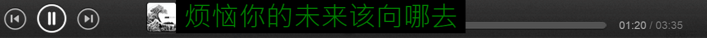

# Lyrics163

- A Chrome extension that is a lyrics assistant for music.163.com

## Running Environment

- Chrome browser

## Development Environment

- Notepad++
- Chrome browser

## External Utility

- waitForKeyElements (https://gist.github.com/BrockA/2625891)
- jQuery (https://github.com/jquery/jquery)

## License

- GNU General Public License (http://www.gnu.org/copyleft/gpl.html)

