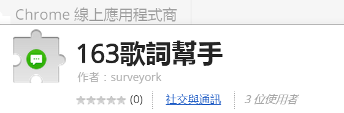
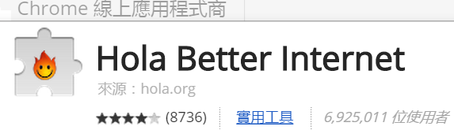
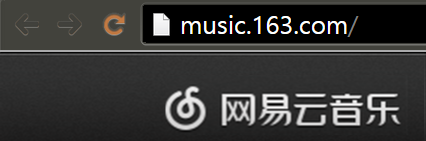
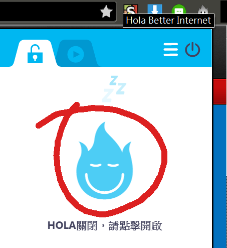
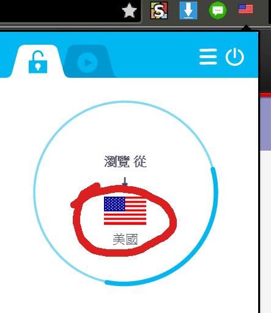
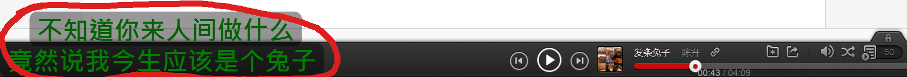
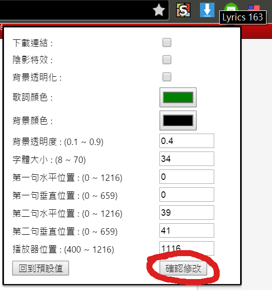

# 163歌詞幫手使用教學

1. 從應用程式商店安裝163歌詞幫手，與VPN跨區工具，方便在163上收聽更多音樂。
  
http://tinyurl.com/nqbyo7z  
  
http://tinyurl.com/prhervy  

2. 前往163音樂網  

3. 啟用安裝好的VPN跨區工具  

4. 選擇美國或中國大陸  

5. 接著便可以選擇喜歡的專輯或自己建立音樂清單來播放  

6. 音樂開始播放後，若這首歌帶有歌詞，預設便會顯示在左下方  

7. 當然你也可以自行調整歌詞字型大小、位置與顏色。  

